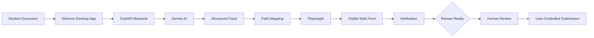

<div align="center">

# AutoFiller AI

### `DOCUMENT → AI → BROWSER AUTOMATION → REVIEW`

AI-assisted desktop automation for turning student documents into verified web-form data.

**Electron** · **React** · **TypeScript** · **FastAPI** · **Gemini** · **Playwright**

</div>

---

## What it solves

School and admission workflows often require staff to read documents and manually copy student information into web forms. AutoFiller AI turns that repetitive workflow into a supervised automation pipeline.

**Input:** student document  →  **Extract:** structured facts  →  **Map:** form fields  →  **Fill:** visible browser  →  **Verify:** source vs. form  →  **Review:** human approval

The project is intentionally designed around a **human-in-the-loop boundary**: automation stops at `REVIEW_READY`; final form submission remains user-controlled.

---

## System architecture



### Core responsibilities

| Layer | Responsibility |
|---|---|
| **Electron + React** | Desktop UI and agent host |
| **FastAPI + Pydantic** | Backend API and validation |
| **Gemini** | Document parsing and semantic field mapping |
| **Playwright** | Visible browser navigation and form interaction |
| **Verification** | Re-check filled values against extracted source data |
| **Safety layer** | Origin/navigation policies, token bridge and submission guardrails |

---

## Workflow

### `01` Upload
Provide a student record such as a PDF, image or text-based document.

### `02` Extract
Gemini converts the document into structured facts such as name, DOB, parent details, address and phone information.

### `03` Discover & map
The agent opens the target website and maps extracted facts to supported controls: text inputs, selects, radio groups and checkboxes.

### `04` Fill visibly
Playwright performs the browser interaction in a visible session so the user can observe the automation.

### `05` Verify
The application re-scans the completed fields and checks them against the source facts.

### `06` Review boundary
Missing or ambiguous information triggers clarification. Once the workflow reaches `REVIEW_READY`, automation stops and the user owns the final decision.

---

## Why this project is interesting

- **Agentic workflow:** combines LLM reasoning with deterministic browser automation.
- **Desktop + backend architecture:** Electron hosts the user experience while FastAPI handles AI-backed processing.
- **Semantic field matching:** maps document facts to form controls rather than relying only on exact labels.
- **Visible automation:** the browser is observable and interruptible instead of being a hidden background process.
- **Verification-first:** filled values are checked before the workflow reaches human review.
- **Safety by design:** strict navigation and submission boundaries are part of the architecture, not an afterthought.

---

## Technology

**Desktop**  
Electron 34 · React 18 · TypeScript · Vite · Playwright

**Backend**  
Python 3.13 · FastAPI · Pydantic v2 · Google Gemini AI · PyMuPDF · MongoDB

**Engineering**  
Dual-token authentication bridge · CSP/security controls · automated tests · Windows packaging

---

## Repository structure

```text
AutoFiller AI/
├── backend/
│   ├── core/              # Backend application logic
│   ├── commons/           # Shared security/authentication utilities
│   ├── scripts/           # Backend utilities
│   ├── tests/             # Backend tests
│   └── main.py            # FastAPI entry point
│
├── desktop/
│   ├── electron/          # Electron main-process code
│   ├── src/               # React application
│   │   ├── components/
│   │   ├── features/
│   │   ├── lib/
│   │   └── types/
│   ├── tests/             # Desktop policy, scanner and E2E tests
│   └── public/             # Mock form + sample document
│
└── AGENTS.md              # Engineering workflow and safety guidelines
```

---

## Run locally

### Prerequisites

- Node.js 18+
- Python 3.11+
- Gemini API key

### Backend

```bash
python -m venv venv
.\venv\Scripts\activate
pip install -r backend/requirements.txt
```

Configure `GEMINI_API_KEY` in your environment, then start the FastAPI service using the project's backend entry point.

### Desktop

```bash
cd desktop
npm install
npm run dev
```

For the packaged Electron application:

```bash
npm run electron
```

---

## Verification

The repository includes separate backend and desktop verification paths.

```bash
# Backend tests
.\venv\Scripts\python.exe -m pytest backend/tests/test_backend.py

# Desktop build + policy + scanner + E2E integration tests
cd desktop
npm run test
```

The desktop test command builds the application before running the policy, tool-registry, scanner and E2E integration checks.

---

## Safety model

```text
DOCUMENT
   ↓
AI EXTRACTION
   ↓
FIELD MAPPING
   ↓
VISIBLE PLAYWRIGHT AUTOMATION
   ↓
VERIFICATION
   ↓
REVIEW_READY  ← automation stops here
   ↓
HUMAN REVIEW
   ↓
USER-CONTROLLED SUBMISSION
```

The system is designed to **clarify instead of guess** when information is missing, ambiguous or conflicting.

---

## Status

**Phase One:** document extraction → browser automation → field mapping → verification → `REVIEW_READY`.

MIT License.